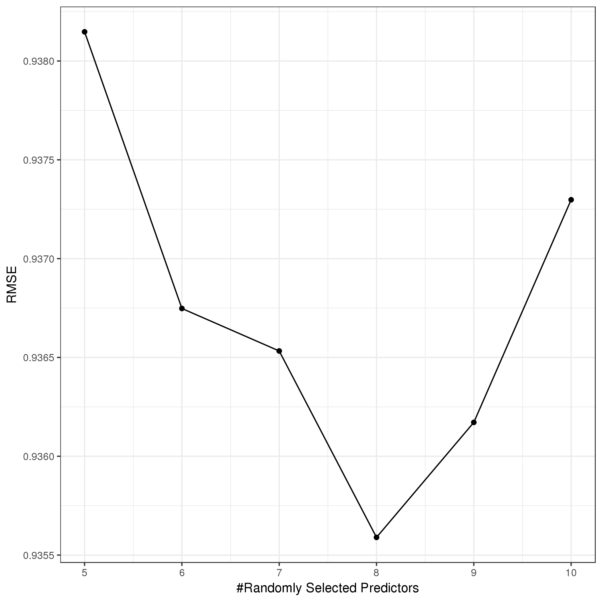
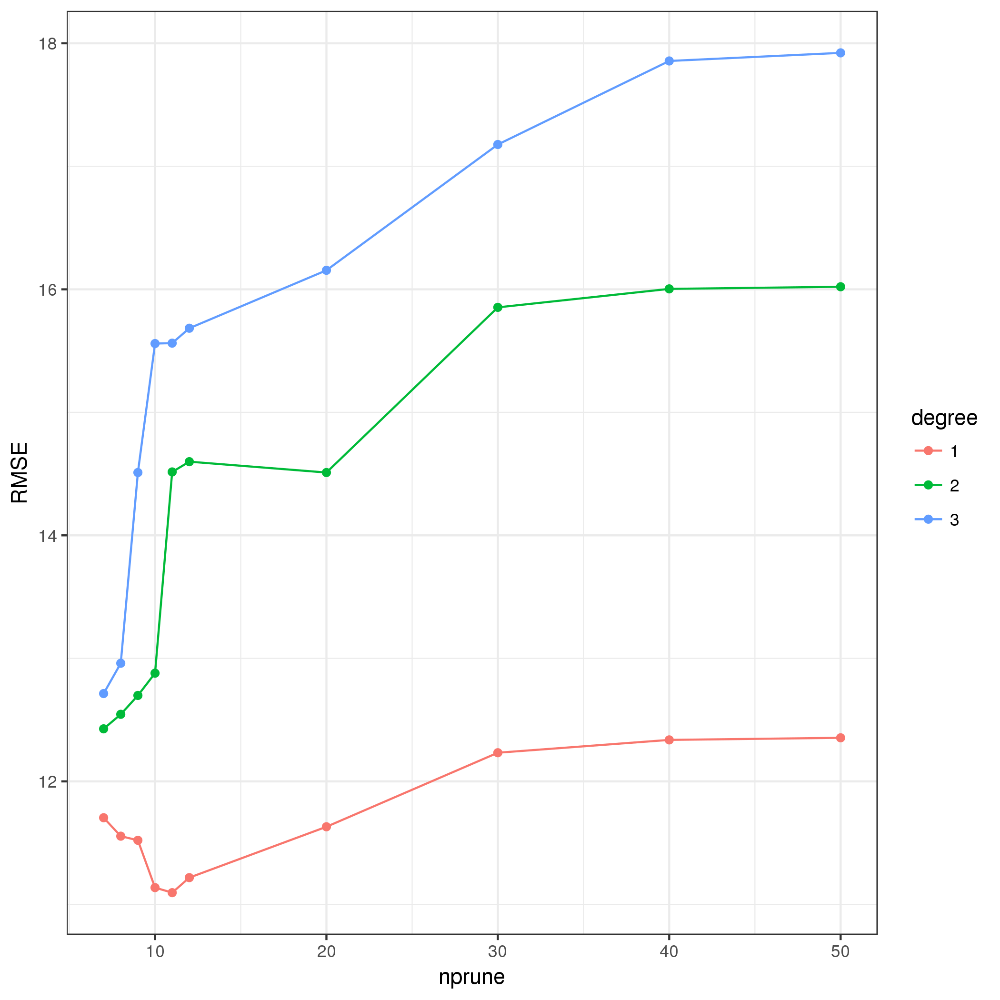

# Import Andrew's SPSS data


Map new names to variables.


|oldnames                       |newnames                       |
|:------------------------------|:------------------------------|
|record_id                      |id                             |
|eng_span                       |languageSurvey                 |
|children_totv_1                |totalChildren                  |
|oldest_middle_youngest         |birthOrder                     |
|child_age_years                |childAge                       |
|Age_Dichot                     |childAgeDichotomous            |
|child_sexv_1                   |childSex                       |
|child_ethnicity                |childEthnicity                 |
|child_racev_1___1              |childRaceWhite                 |
|child_racev_1___2              |childRaceAsian                 |
|child_racev_1___3              |childRaceAfrAm                 |
|child_racev_1___4              |childRaceAIAN                  |
|child_racev_1___5              |childRaceNHPI                  |
|child_racev_1___6              |childRaceOther                 |
|child_racev_1___7              |childRaceNoResp                |
|visit_typev_1                  |visitType                      |
|related_child                  |childRelationship              |
|gender                         |parentGender                   |
|parent_sexv_1                  |parentSex                      |
|parent_agev_1                  |parentAge                      |
|parent_ethnicity               |parentEthnicity                |
|parent_race___1                |parentRaceWhite                |
|parent_race___2                |parentRaceAsian                |
|parent_race___3                |parentRaceAfrAm                |
|parent_race___4                |parentRaceAIAN                 |
|parent_race___5                |parentRaceNHPI                 |
|parent_race___6                |parentRaceOther                |
|parent_race___7                |parentRaceNoResp               |
|marital_status                 |parentMaritalStatus            |
|parenting_situationv_1         |parentSituation                |
|zipcode                        |zipcode                        |
|community_type                 |community                      |
|distance                       |distance                       |
|parent_educationv_1            |parentEducation                |
|annual_income                  |income                         |
|internet                       |internet                       |
|ECBI_intensity_raw_score       |ECBI_intensity_raw_score       |
|ECBI_intensity_T_score         |ECBI_intensity_T_score         |
|ECBI_intensity_clinical_cutoff |ECBI_intensity_clinical_cutoff |
|ECBI_problem_raw_score         |ECBI_problem_raw_score         |
|ECBI_problem_T_score           |ECBI_problem_T_score           |
|ECBI_problem_clinical_cutoff   |ECBI_problem_clinical_cutoff   |
|ECBI_OPP_Tot                   |ECBI_OPP_Tot                   |
|ECBI_Inatt_Tot                 |ECBI_Inatt_Tot                 |
|ECBI_Cond_Tot                  |ECBI_Cond_Tot                  |
|MAPS_PP                        |MAPS_PP                        |
|MAPS_PR                        |MAPS_PR                        |
|MAPS_WM                        |MAPS_WM                        |
|MAPS_SP                        |MAPS_SP                        |
|MAPS_HS                        |MAPS_HS                        |
|MAPS_LC                        |MAPS_LC                        |
|MAPS_PC                        |MAPS_PC                        |
|MAPS_POS                       |MAPS_POS                       |
|MAPS_NEG                       |MAPS_NEG                       |
|SEPTI_nurturance               |SEPTI_nurturance               |
|SEPTI_n_clinical_cutoff        |SEPTI_n_clinical_cutoff        |
|SEPTI_discipline               |SEPTI_discipline               |
|SEPTI_d_clinical_cutoff        |SEPTI_d_clinical_cutoff        |
|SEPTI_play                     |SEPTI_play                     |
|SEPTI_p_clinical_cutoff        |SEPTI_p_clinical_cutoff        |
|SEPTI_routine                  |SEPTI_routine                  |
|SEPTI_r_clinical_cutoff        |SEPTI_r_clinical_cutoff        |
|SEPTI_total                    |SEPTI_total                    |
|SEPTI_total_clin_cutoff        |SEPTI_total_clin_cutoff        |
|Y1                             |Y1                             |
|Y2                             |Y2                             |
|Y3                             |Y3                             |


Build analysis data set.
Exclude if missing any dependent variable, `Y1`, `Y2`, `Y3`.


```
##        Y1              Y2              Y3       
##  Min.   :19.00   Min.   : 6.00   Min.   :15.00  
##  1st Qu.:60.00   1st Qu.:22.00   1st Qu.:39.00  
##  Median :75.00   Median :25.00   Median :48.00  
##  Mean   :71.34   Mean   :24.53   Mean   :47.56  
##  3rd Qu.:85.00   3rd Qu.:28.00   3rd Qu.:57.00  
##  Max.   :95.00   Max.   :30.00   Max.   :75.00
```


# Preprocess data

Initial preprocesssing that needs to be done that is common to `Y1`, `Y2`, and `Y3`.

Split data set into 70:30 training:validation samples.


```r
inTrain <- createDataPartition(df$id, p = 0.7)
dfTrain <- df[inTrain$Resample1, ]
dfValid <- df[-inTrain$Resample1, ]
```

Preprocess the training sample.

1. Exclude near-zero variance predictors
2. Impute missing values using k-nearest neighbor


```r
message(sprintf("Number of complete cases before imputation = %d",
                complete.cases(dfTrain) %>% sum()))
```

```
## Number of complete cases before imputation = 247
```

```r
nzv <- 
  dfTrain %>% 
  select(-c(id, Y1, Y2, Y3)) %>% 
  nearZeroVar(names = TRUE, saveMetric = TRUE) %>%
  mutate(varname = row.names(.)) %>% 
  filter(nzv == TRUE) %>% 
  select(varname, freqRatio, percentUnique, zeroVar, nzv) 
nzv %>% kable()
```


|varname         | freqRatio| percentUnique|zeroVar |nzv  |
|:---------------|---------:|-------------:|:-------|:----|
|languageSurvey  |  53.80000|      0.729927|FALSE   |TRUE |
|childRaceAfrAm  |  26.40000|      0.729927|FALSE   |TRUE |
|childRaceAIAN   |  38.14286|      0.729927|FALSE   |TRUE |
|childRaceNHPI   |  44.66667|      0.729927|FALSE   |TRUE |
|childRaceOther  |  21.83333|      0.729927|FALSE   |TRUE |
|parentRaceAfrAm |  44.66667|      0.729927|FALSE   |TRUE |
|parentRaceAIAN  |  29.44444|      0.729927|FALSE   |TRUE |
|parentRaceNHPI  |  44.66667|      0.729927|FALSE   |TRUE |
|parentRaceOther |  20.07692|      0.729927|FALSE   |TRUE |
|internet        |  33.25000|      0.729927|FALSE   |TRUE |

```r
dfTrainPreProc1 <-
  dfTrain %>% 
  select(-one_of(nzv$varname))
dfOutcomes <- 
  dfTrainPreProc1 %>% 
  select(c(id, Y1, Y2, Y3))
dfTrainPreProc2 <- 
  dfTrainPreProc1 %>% 
  select(-c(id, Y1, Y2, Y3))
preProc <-
  dfTrainPreProc2 %>% 
  preProcess(method = c("nzv", "corr", "knnImpute"), verbose = TRUE)
```

```
##   2 highly correlated predictors were removed.
## Calculating 30 means for centering
## Calculating 30 standard deviations for scaling
```

```r
preProc
```

```
## Created from 247 samples and 53 variables
## 
## Pre-processing:
##   - centered (30)
##   - ignored (21)
##   - 5 nearest neighbor imputation (30)
##   - removed (2)
##   - scaled (30)
```

```r
dfTrainPreProc3 <-  
  predict(preProc, dfTrainPreProc2) %>% 
  mutate(childAgeDichotomous = case_when(is.na(childAgeDichotomous) & childAge < 3 ~ 1,
                                         is.na(childAgeDichotomous) & childAge >= 3 ~ 2,
                                         TRUE ~ as.numeric(childAgeDichotomous))) %>% 
  mutate(childAgeDichotomous = factor(childAgeDichotomous, 
                                      levels = seq(2), 
                                      labels = c("Under 3", "3 or older")))
dfTrainPreProc <- bind_cols(dfOutcomes, dfTrainPreProc3)
message(sprintf("Number of complete cases after imputation = %d",
                complete.cases(dfTrainPreProc) %>% sum()))
```

```
## Number of complete cases after imputation = 274
```

```r
save(dfTrainPreProc, dfValid, dfTrain, df, file = "data/processed/dataframes.RData")
dfTrainPreProc %>% write.csv("data/processed/dfTrainPreProc.csv", row.names = FALSE)
rm(dfTrainPreProc1, dfTrainPreProc2, dfTrainPreProc3)
```

Set the control parameters.


```r
ctrl <- trainControl(method = "LOOCV",
                     savePredictions = TRUE,
                     allowParallel = TRUE,
                     search = "random")
cores <- 24
```

Set the model and tuning parameter grid.


```r
library(earth)
```

```
## Loading required package: plotmo
```

```
## Loading required package: plotrix
```

```
## Loading required package: TeachingDemos
```

```r
method <- "earth"
modelLookup(method) %>% kable()
```


|model |parameter |label          |forReg |forClass |probModel |
|:-----|:---------|:--------------|:------|:--------|:---------|
|earth |nprune    |#Terms         |TRUE   |TRUE     |TRUE      |
|earth |degree    |Product Degree |TRUE   |TRUE     |TRUE      |

```r
grid <- expand.grid(nprune = c(seq(2, 8, 1), seq(10, 50, 10)),
                    degree = seq(3))
grid %>% kable()
```


| nprune| degree|
|------:|------:|
|      2|      1|
|      3|      1|
|      4|      1|
|      5|      1|
|      6|      1|
|      7|      1|
|      8|      1|
|     10|      1|
|     20|      1|
|     30|      1|
|     40|      1|
|     50|      1|
|      2|      2|
|      3|      2|
|      4|      2|
|      5|      2|
|      6|      2|
|      7|      2|
|      8|      2|
|     10|      2|
|     20|      2|
|     30|      2|
|     40|      2|
|     50|      2|
|      2|      3|
|      3|      3|
|      4|      3|
|      5|      3|
|      6|      3|
|      7|      3|
|      8|      3|
|     10|      3|
|     20|      3|
|     30|      3|
|     40|      3|
|     50|      3|

```r
citation(method)
```

```
## 
## To cite package 'earth' in publications use:
## 
##   Stephen Milborrow. Derived from mda:mars by Trevor Hastie and
##   Rob Tibshirani. Uses Alan Miller's Fortran utilities with Thomas
##   Lumley's leaps wrapper. (2018). earth: Multivariate Adaptive
##   Regression Splines. R package version 4.6.2.
##   https://CRAN.R-project.org/package=earth
## 
## A BibTeX entry for LaTeX users is
## 
##   @Manual{,
##     title = {earth: Multivariate Adaptive Regression Splines},
##     author = {Stephen Milborrow. Derived from mda:mars by Trevor Hastie and Rob Tibshirani. Uses Alan Miller's Fortran utilities with Thomas Lumley's leaps wrapper.},
##     year = {2018},
##     note = {R package version 4.6.2},
##     url = {https://CRAN.R-project.org/package=earth},
##   }
## 
## ATTENTION: This citation information has been auto-generated from
## the package DESCRIPTION file and may need manual editing, see
## 'help("citation")'.
```


# Model 1

Prediction model for `Y1`.

Train model over the tuning parameters.


```
## Multivariate Adaptive Regression Spline 
## 
## 274 samples
##  51 predictor
## 
## No pre-processing
## Resampling: Leave-One-Out Cross-Validation 
## Summary of sample sizes: 273, 273, 273, 273, 273, 273, ... 
## Resampling results across tuning parameters:
## 
##   nprune  degree  RMSE      Rsquared     MAE     
##    2      1       17.01071  0.066389559  13.49196
##    2      2       17.11130  0.056746018  13.52673
##    2      3       17.94193  0.001591162  14.37905
##    3      1       17.00095  0.071158964  13.44421
##    3      2       19.27878  0.011430008  14.31089
##    3      3       17.54470  0.022128835  13.95639
##    4      1       17.09116  0.068487315  13.49252
##    4      2       19.50641  0.007266362  14.68732
##    4      3       17.87813  0.019773362  14.25694
##    5      1       17.65130  0.034266093  13.94014
##    5      2       20.30220  0.004463746  15.12980
##    5      3       17.93490  0.020855849  14.23640
##    6      1       17.53932  0.043273329  13.96819
##    6      2       20.52897  0.003907908  15.32919
##    6      3       18.13757  0.019411830  14.47820
##    7      1       17.37497  0.060441465  13.59799
##    7      2       20.65269  0.007363705  15.50435
##    7      3       18.14849  0.022799821  14.53092
##    8      1       17.82241  0.049180349  13.87009
##    8      2       20.61689  0.009136240  15.44326
##    8      3       18.18823  0.026907086  14.59668
##   10      1       18.29080  0.029023368  14.33433
##   10      2       20.37193  0.023463104  15.11353
##   10      3       18.42004  0.028206489  14.70860
##   20      1       19.22172  0.033087034  14.89624
##   20      2       20.36811  0.059220540  14.96274
##   20      3       19.20482  0.045929487  14.83053
##   30      1       19.50963  0.039510878  15.04542
##   30      2       20.65181  0.062933831  15.38412
##   30      3       23.71532  0.041514668  16.27041
##   40      1       19.56067  0.038722960  15.08410
##   40      2       20.60930  0.066798344  15.42893
##   40      3       31.63776  0.035199160  17.91783
##   50      1       19.56067  0.038722960  15.08410
##   50      2       20.61180  0.066644590  15.43571
##   50      3       32.45119  0.031278783  18.89169
## 
## RMSE was used to select the optimal model using the smallest value.
## The final values used for the model were nprune = 3 and degree = 1.
```





```
## Selected 3 of 122 terms, and 2 of 163 predictors
## Termination condition: Reached nk 201
## Importance: childRaceWhite, SEPTI_total, totalChildren-unused, ...
## Number of terms at each degree of interaction: 1 2 (additive model)
## GCV 285.8836    RSS 75499.36    GRSq 0.0838927    RSq 0.1105417
```

```
## Call: earth(x=matrix[274,163], y=c(77,79,80,40,7...), keepxy=TRUE,
##             degree=1, nprune=3)
## 
##                          coefficients
## (Intercept)                 75.972994
## childRaceWhite             -11.755010
## h(SEPTI_total- -1.22401)     3.583336
## 
## Selected 3 of 122 terms, and 2 of 163 predictors
## Termination condition: Reached nk 201
## Importance: childRaceWhite, SEPTI_total, totalChildren-unused, ...
## Number of terms at each degree of interaction: 1 2 (additive model)
## GCV 285.8836    RSS 75499.36    GRSq 0.0838927    RSq 0.1105417
```


```
## earth variable importance
## 
##   only 20 most important variables shown (out of 163)
## 
##                                            Overall
## childRaceWhite                              100.00
## SEPTI_total                                  48.52
## zipcode97232                                  0.00
## zipcode97203                                  0.00
## SEPTI_n_clinical_cutoff                       0.00
## zipcode97759                                  0.00
## visitTypeBehavioralordevelopmentalconcern     0.00
## zipcode97266                                  0.00
## parentRaceWhite                               0.00
## zipcode97007                                  0.00
## parentGenderPrefernottorespond                0.00
## parentMaritalStatusRemarried                  0.00
## zipcode97209                                  0.00
## zipcode97753                                  0.00
## parentMaritalStatusSeparated                  0.00
## zipcode98685                                  0.00
## parentMaritalStatusDivorced                   0.00
## zipcode97140                                  0.00
## parentEducationGraduate/professionalschool    0.00
## zipcode97220                                  0.00
```

```{r Y1Training-predict)
dfTrainPred <- 
  dfTrainPreProc %>% 
  mutate(hat = predict(trainingModel, dfTrainPreProc) %>% as.numeric())
postResample(pred = dfTrainPred$hat, obs = dfTrainPred$Y1)
cor(dfTrainPred %>% select(Y1, hat))
dfTrainPred %>% 
  ggplot() +
  ggtitle(sprintf("Correlation = %.03f", cor(dfTrainPred %>% select(Y1, hat)) %>% .[1, 2])) +
  aes(x = hat, y = Y1) +
  geom_abline(slope = 1, intercept = 0) +
  geom_smooth(method = "lm", formula = y ~ x - 1, color = rgb(0, 0, 1, 0.5), se = FALSE) +
  geom_smooth(method = "lm", formula = y ~ x, color = rgb(1, 0, 0, 0.5), se = FALSE) +
  geom_point(alpha = 1/2)
```

Evaluate model on the validation sample.


```
##        RMSE    Rsquared         MAE 
## 17.19504421  0.04047677 13.71400070
```

```
##            Y1       hat
## Y1  1.0000000 0.2011884
## hat 0.2011884 1.0000000
```


# Model 2

Prediction model for `Y2`.

Train model over the tuning parameters.


```
## Multivariate Adaptive Regression Spline 
## 
## 274 samples
##  51 predictor
## 
## No pre-processing
## Resampling: Leave-One-Out Cross-Validation 
## Summary of sample sizes: 273, 273, 273, 273, 273, 273, ... 
## Resampling results across tuning parameters:
## 
##   nprune  degree  RMSE      Rsquared      MAE     
##    2      1       4.368384  3.797850e-02  3.306652
##    2      2       4.480751  1.682845e-03  3.411642
##    2      3       4.376631  3.644362e-02  3.329237
##    3      1       4.506589  1.108744e-02  3.375671
##    3      2       4.680459  1.002439e-02  3.541668
##    3      3       4.430991  2.652310e-02  3.344351
##    4      1       4.365685  5.225885e-02  3.303962
##    4      2       4.634167  9.892086e-05  3.517387
##    4      3       4.689664  1.777289e-02  3.461826
##    5      1       4.246140  9.749025e-02  3.179190
##    5      2       4.619831  7.491875e-03  3.418386
##    5      3       4.690180  2.211782e-02  3.442098
##    6      1       4.290732  8.321978e-02  3.199407
##    6      2       4.720549  5.484975e-03  3.492137
##    6      3       4.713808  2.333858e-02  3.386673
##    7      1       4.299308  8.254588e-02  3.196060
##    7      2       5.004758  1.173854e-03  3.685601
##    7      3       4.806895  1.428249e-02  3.461804
##    8      1       4.314136  8.849103e-02  3.256080
##    8      2       5.171066  2.526670e-03  3.690156
##    8      3       5.588508  3.433394e-03  3.661685
##   10      1       4.387356  7.918000e-02  3.273834
##   10      2       5.239252  3.670754e-03  3.762855
##   10      3       5.865765  2.699826e-03  3.795237
##   20      1       4.683530  4.209701e-02  3.503013
##   20      2       7.209287  1.414714e-02  4.200088
##   20      3       7.841644  1.074778e-02  4.357567
##   30      1       4.796316  3.628903e-02  3.601891
##   30      2       7.455225  1.543877e-02  4.306579
##   30      3       8.785494  1.068305e-02  4.822067
##   40      1       4.788828  3.629807e-02  3.619974
##   40      2       7.496369  1.488179e-02  4.342358
##   40      3       8.768120  7.755144e-03  5.086804
##   50      1       4.787092  3.646535e-02  3.618447
##   50      2       7.496439  1.487033e-02  4.343411
##   50      3       8.780179  7.480996e-03  5.127157
## 
## RMSE was used to select the optimal model using the smallest value.
## The final values used for the model were nprune = 5 and degree = 1.
```


```
## Selected 4 of 122 terms, and 3 of 163 predictors
## Termination condition: Reached nk 201
## Importance: MAPS_POS, zipcode97702, SEPTI_r_clinical_cutoff, ...
## Number of terms at each degree of interaction: 1 3 (additive model)
## GCV 17.89015    RSS 4654.639    GRSq 0.1036596    RSq 0.1426262
```

```
## Call: earth(x=matrix[274,163], y=c(25,29,25,22,2...), keepxy=TRUE,
##             degree=1, nprune=5)
## 
##                         coefficients
## (Intercept)                23.609727
## zipcode97702               -4.151507
## SEPTI_r_clinical_cutoff    -1.000289
## h(MAPS_POS- -0.636609)      1.636962
## 
## Selected 4 of 122 terms, and 3 of 163 predictors
## Termination condition: Reached nk 201
## Importance: MAPS_POS, zipcode97702, SEPTI_r_clinical_cutoff, ...
## Number of terms at each degree of interaction: 1 3 (additive model)
## GCV 17.89015    RSS 4654.639    GRSq 0.1036596    RSq 0.1426262
```


```
## earth variable importance
## 
##   only 20 most important variables shown (out of 163)
## 
##                                             Overall
## MAPS_POS                                     100.00
## zipcode97702                                  79.97
## SEPTI_r_clinical_cutoff                       58.54
## ECBI_Cond_Tot                                  0.00
## zipcode97760                                   0.00
## SEPTI_play                                     0.00
## communityRural                                 0.00
## income$120,000-$149,999                        0.00
## zipcode91206                                   0.00
## parentMaritalStatusRemarried                   0.00
## parentMaritalStatusWidowed                     0.00
## zipcode97123                                   0.00
## zipcode97201                                   0.00
## zipcode97062                                   0.00
## zipcode97707                                   0.00
## zipcode97267                                   0.00
## parentEducationVocationalschool/somecollege    0.00
## zipcode97203                                   0.00
## zipcode97035                                   0.00
## zipcode97222                                   0.00
```


```
##      RMSE  Rsquared       MAE 
## 4.1216177 0.1426262 3.0991466
```

```
##            Y2       hat
## Y2  1.0000000 0.3776588
## hat 0.3776588 1.0000000
```


Evaluate model on the validation sample.


```
##       RMSE   Rsquared        MAE 
## 4.92654917 0.01302418 3.45931558
```

```
##            Y2       hat
## Y2  1.0000000 0.1141235
## hat 0.1141235 1.0000000
```


# Model 3

Prediction model for `Y3`.

Train model over the tuning parameters.


| nprune| degree|
|------:|------:|
|      7|      1|
|      8|      1|
|      9|      1|
|     10|      1|
|     11|      1|
|     12|      1|
|     20|      1|
|     30|      1|
|     40|      1|
|     50|      1|
|      7|      2|
|      8|      2|
|      9|      2|
|     10|      2|
|     11|      2|
|     12|      2|
|     20|      2|
|     30|      2|
|     40|      2|
|     50|      2|
|      7|      3|
|      8|      3|
|      9|      3|
|     10|      3|
|     11|      3|
|     12|      3|
|     20|      3|
|     30|      3|
|     40|      3|
|     50|      3|

```
## Multivariate Adaptive Regression Spline 
## 
## 274 samples
##  51 predictor
## 
## No pre-processing
## Resampling: Leave-One-Out Cross-Validation 
## Summary of sample sizes: 273, 273, 273, 273, 273, 273, ... 
## Resampling results across tuning parameters:
## 
##   nprune  degree  RMSE      Rsquared     MAE      
##    7      1       11.70453  0.072147058   9.710537
##    7      2       12.42722  0.045432273   9.991517
##    7      3       12.71392  0.028196167  10.087757
##    8      1       11.55472  0.091435279   9.513031
##    8      2       12.54527  0.040051806   9.966195
##    8      3       12.96045  0.024080626  10.232657
##    9      1       11.52106  0.099193707   9.465558
##    9      2       12.69862  0.034068349  10.091426
##    9      3       14.51075  0.008800328  10.600236
##   10      1       11.13647  0.143348768   9.143681
##   10      2       12.87964  0.030139684  10.286174
##   10      3       15.55924  0.024705189  10.911553
##   11      1       11.09536  0.151304445   9.100319
##   11      2       14.51557  0.015368274  10.762851
##   11      3       15.56249  0.020987940  10.965857
##   12      1       11.21765  0.138712626   9.239709
##   12      2       14.59893  0.017977696  10.783736
##   12      3       15.68379  0.027235158  10.906679
##   20      1       11.63112  0.119418742   9.367256
##   20      2       14.51071  0.037345487  11.044163
##   20      3       16.15479  0.032296972  11.447146
##   30      1       12.23299  0.084099834   9.733953
##   30      2       15.85349  0.028061228  11.833118
##   30      3       17.17734  0.036016421  12.049696
##   40      1       12.33729  0.088615553   9.887005
##   40      2       16.00370  0.028870122  11.961394
##   40      3       17.85649  0.032920401  12.392192
##   50      1       12.35434  0.088041010   9.886718
##   50      2       16.02090  0.028195487  11.974502
##   50      3       17.92229  0.030347782  12.435152
## 
## RMSE was used to select the optimal model using the smallest value.
## The final values used for the model were nprune = 11 and degree = 1.
```





```
## Selected 11 of 122 terms, and 8 of 163 predictors
## Termination condition: Reached nk 201
## Importance: SEPTI_total, SEPTI_discipline-unused, childAge, ...
## Number of terms at each degree of interaction: 1 10 (additive model)
## GCV 110.1297    RSS 25727.34    GRSq 0.2133396    RSq 0.3243791
```

```
## Call: earth(x=matrix[274,163], y=c(58,54,64,41,5...), keepxy=TRUE,
##             degree=1, nprune=11)
## 
##                                                 coefficients
## (Intercept)                                        38.826249
## parentSituationCo-parentinginseparatehouseholds     9.275497
## zipcode97229                                       12.618717
## zipcode97734                                      -20.177892
## h(childAge-1.12293)                               -13.410964
## h(parentAge- -1.24675)                             -2.561029
## h(-1.63029-ECBI_intensity_T_score)                 -5.349963
## h(ECBI_intensity_T_score- -1.63029)                 3.294158
## h(-1.06097-ECBI_problem_raw_score)                 95.515227
## h(-1.45385-SEPTI_total)                            22.897959
## h(SEPTI_total- -1.45385)                            3.958761
## 
## Selected 11 of 122 terms, and 8 of 163 predictors
## Termination condition: Reached nk 201
## Importance: SEPTI_total, SEPTI_discipline-unused, childAge, ...
## Number of terms at each degree of interaction: 1 10 (additive model)
## GCV 110.1297    RSS 25727.34    GRSq 0.2133396    RSq 0.3243791
```


```
## earth variable importance
## 
##   only 20 most important variables shown (out of 163)
## 
##                                                 Overall
## SEPTI_total                                      100.00
## childAge                                          88.32
## ECBI_problem_raw_score                            65.34
## parentSituationCo-parentinginseparatehouseholds   49.66
## parentAge                                         32.61
## zipcode97734                                      32.61
## ECBI_intensity_T_score                            32.61
## zipcode97229                                      32.61
## zipcode97206                                       0.00
## zipcode97027                                       0.00
## parentEthnicityNotHispanic/Latino                  0.00
## zipcode97213                                       0.00
## zipcode97825                                       0.00
## zipcode97086                                       0.00
## parentEthnicityPrefernottorespond                  0.00
## distance                                           0.00
## zipcode97086-3615                                  0.00
## zipcode90210                                       0.00
## zipcode97214                                       0.00
## MAPS_LC                                            0.00
```


```
##      RMSE  Rsquared       MAE 
## 9.6899639 0.3243791 7.9315828
```

```
##            Y3       hat
## Y3  1.0000000 0.5695429
## hat 0.5695429 1.0000000
```


Evaluate model on the validation sample.


```
##         RMSE     Rsquared          MAE 
## 14.147148035  0.002805804 10.870320503
```

```
##             Y3        hat
## Y3  1.00000000 0.05296984
## hat 0.05296984 1.00000000
```


