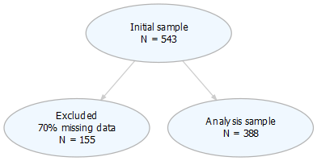

```{r, echo = FALSE, include = FALSE}
library(checkpoint)
checkpoint("2018-04-01", use.knitr = TRUE, verbose = FALSE)

library(magrittr)
library(tidyverse)
library(haven)
# library(DiagrammeR)
# library(DiagrammeRsvg)
library(ggplot2)
library(RColorBrewer)
library(LaCroixColoR)
library(svglite)
library(caret)
library(parallel)
library(doParallel)
library(RANN)
library(knitr)

set.seed(as.integer(as.Date("2018-06-04")))

theme_set(theme_bw())
theme_update(plot.title = element_text(hjust = 0.5))

# sapply(list.files("lib", full.names = TRUE), source)
```


# Import Andrew's SPSS data

```{r}
df <-
  "data/raw/corrected 6.15.sav" %>% 
  read_sav() 
oldnames <- names(df)
newnames <- c("id",
              "languageSurvey",
              "totalChildren",
              "birthOrder",
              "childSex",
              "childAge",
              "childEthnicity",
              "childRaceWhite",
              "childRaceAsian",
              "childRaceAfrAm",
              "childRaceAIAN",
              "childRaceNHPI",
              "childRaceOther",
              "childRaceNoResp",
              "childRelationship",
              "parentGender",
              "parentSex",
              "parentAge",
              "parentEthnicity",
              "parentRaceWhite",
              "parentRaceAsian",
              "parentRaceAfrAm",
              "parentRaceAIAN",
              "parentRaceNHPI",
              "parentRaceOther",
              "parentRaceNoResp",
              "parentMaritalStatus",
              "parentSituation",
              "parentsNumber",
              "parentChildRatio",
              "zipcodeClass",
              "zipcode",
              "community",
              "distance",
              "parentEducation",
              "income",
              "internet")
newnames <- c(newnames, oldnames[(1 + length(newnames)):length(oldnames)])
newnames <- gsub("^PBC", "PCB", newnames)
names(df) <- newnames
```

Map new names to variables.

```{r}
data.frame(oldnames, newnames) %>% kable()
```

```{r, eval = FALSE}
df %>% group_by(childRaceWhite) %>% dplyr::summarize(n = n())
df %>% group_by(parentsNumber) %>% dplyr::summarize(n = n())
df %>% group_by(parentChildRatio) %>% dplyr::summarize(n = n())
df %>% group_by(zipcodeClass) %>% dplyr::summarize(n = n())
df %>% group_by(zipcode) %>% dplyr::summarize(n = n())
df %>% group_by(community) %>% dplyr::summarize(n = n())
```

```{r}
df <- 
  df %>%
  mutate(languageSurvey = factor(languageSurvey,
                                 levels = seq(2), 
                                 labels = c("English", "Spanish"))) %>% 
  mutate(birthOrder = case_when(totalChildren == 1 ~ 0,
                                TRUE ~ as.numeric(birthOrder)) %>% 
                      factor(., 
                             levels = 0:3, 
                             labels = c("Only child", "Oldest", "Middle", "Youngest"))) %>% 
  mutate(childSex = factor(childSex, 
                           levels = seq(2), 
                           labels = c("Female", "Male"))) %>% 
  mutate(childEthnicity = factor(childEthnicity, 
                                 levels = seq(4), 
                                 labels = c("Hispanic/Latino", 
                                            "Not Hispanic/Latino", 
                                            "Unknown", 
                                            "Prefer not to respond"))) %>% 
  mutate(childRaceWhite = factor(childRaceWhite),
         childRaceAsian = factor(childRaceAsian),
         childRaceAfrAm = factor(childRaceAfrAm),
         childRaceAIAN = factor(childRaceAIAN),
         childRaceNHPI = factor(childRaceNHPI),
         childRaceOther = factor(childRaceOther),
         childRaceNoResp = factor(childRaceNoResp)) %>% 
  mutate(childRelationship = factor(childRelationship,
                                    levels = seq(6),
                                    labels = c("Biological or adoptive mother",
                                               "Biological or adoptive father",
                                               "Step parent",
                                               "Grandparent",
                                               "Relative",
                                               "Other"))) %>% 
  mutate(parentGender = factor(parentGender,
                               levels = seq(5),
                               labels = c("Male",
                                          "Female",
                                          "Transgender",
                                          "Other",
                                          "Prefer not to respond"))) %>% 
  mutate(parentSex = factor(parentSex, 
                            levels = seq(2), 
                            labels = c("Female", "Male"))) %>% 
  mutate(parentEthnicity = factor(parentEthnicity, 
                                  levels = seq(4), 
                                  labels = c("Hispanic/Latino", 
                                             "Not Hispanic/Latino", 
                                             "Unknown", 
                                             "Prefer not to respond"))) %>% 
  mutate(parentRaceWhite = factor(parentRaceWhite),
         parentRaceAsian = factor(parentRaceAsian),
         parentRaceAfrAm = factor(parentRaceAfrAm),
         parentRaceAIAN = factor(parentRaceAIAN),
         parentRaceNHPI = factor(parentRaceNHPI),
         parentRaceOther = factor(parentRaceOther),
         parentRaceNoResp = factor(parentRaceNoResp)) %>% 
  mutate(parentMaritalStatus = factor(parentMaritalStatus,
                                      levels = seq(6),
                                      labels = c("Married",
                                                 "Widowed",
                                                 "Divorced",
                                                 "Separated",
                                                 "Remarried",
                                                 "Never married"))) %>% 
  mutate(parentSituation = factor(parentSituation,
                                  levels = seq(3),
                                  labels = c("Single parenting",
                                             "Couple parenting with spouse or partner in the same household",
                                             "Co-parenting in separate households"))) %>% 
  mutate(zipcodeClass = factor(zipcodeClass)) %>% 
  mutate(zipcode = factor(zipcode)) %>% 
  mutate(community = factor(community, levels = seq(3), labels = c("Urban", "Suburban", "Rural"))) %>% 
  mutate(parentEducation = factor(parentEducation,
                                  levels = seq(4),
                                  labels = c("High school or less",
                                             "Vocational school/some college",
                                             "College",
                                             "Graduate/professional school"))) %>% 
  mutate(income = factor(income,
                         levels = seq(6),
                         labels = c("$25,000 or less",
                                    "$25,001-$49,999",
                                    "$50,000-$79,999",
                                    "$80,000-$119,999",
                                    "$120,000-$149,999",
                                    "$150,000 or more")))
```

Remove certain predictor variables:

* Clinical cutoffs
* Raw scores
* Total scores

```{r}
varToRemove <- 
  df %>% 
  names() %>% 
  grep("((cutoff)|(raw_score)|(total))$", ., value = TRUE)
varToRemove
df <- 
  df %>% 
  select(-one_of(varToRemove))
```

```{r, eval = FALSE}
library(dataMaid)
makeCodebook(df, file = "output/codebook.Rmd", replace = TRUE)
df %>% write.csv("data/processed/df.csv", row.names = FALSE)
```

Build analysis data set.
Exclude if missing any dependent variable, `PCB1_Total`, `PCB2_Tot`, `PCB3_Total`.
Exclude rows if there are a high proportion of row-wise `NA`.

```{r}
n0 <- nrow(df)
threshold <- 0.70
df <-
  df %>%
  mutate(propNA = rowSums(is.na(.)) / ncol(.)) %>% 
  filter(propNA < threshold) %>% 
  select(-propNA)
summary(df[, c("PCB1_Total", "PCB2_Tot", "PCB3_Total")])
```



```{r, eval = FALSE}
label <- sprintf("%s\nN = %d", 
                 c("Initial sample", 
                   sprintf("Excluded\n%d%% missing data", threshold * 100), 
                   "Analysis sample"), 
                 c(n0, 
                   n0 - nrow(df), 
                   nrow(df)))
nodes <- data.frame(text = label)
edges <- 
  create_edge_df(from = c(1, 1),
                 to   = c(2, 3))
G <-
  create_graph() %>% 
  add_nodes_from_table(table = nodes, label_col = "text") %>%
  add_edge_df(edges) %>% 
  add_global_graph_attrs("layout", "dot", "graph") %>%
  add_global_graph_attrs("shape", "oval", "node") %>%
  add_global_graph_attrs("width", "2", "node") %>%
  add_global_graph_attrs("height", "0.8", "node") %>%
  add_global_graph_attrs("fontcolor", "black", "node")
# render_graph(G)
G %>% export_graph(file_name = "figures/flowChart.png", file_type = "png")
G %>% export_graph(file_name = "figures/flowChart.svg", file_type = "svg")
```


[https://uc-r.github.io/hc_clustering](https://uc-r.github.io/hc_clustering)
[http://www.sthda.com/english/wiki/factoextra-r-package-easy-multivariate-data-analyses-and-elegant-visualization](http://www.sthda.com/english/wiki/factoextra-r-package-easy-multivariate-data-analyses-and-elegant-visualization)

```{r}
library(cluster)
library(ggdendro)
library(factoextra)
library(dendextend)
library(NbClust)
citation("factoextra")
pal <- brewer.pal(9, "Set1")
# pal <- lacroix_palette("PommeBaya", type = "discrete")
```

```{r}
plotClusters <- function (df, title = "Cluster plot") {
  require(magrittr)
  require(ggplot2)
  require(factoextra)
  df %>% 
  fviz_cluster(data = mat, 
               palette = sprintf("%s7F", pal), 
               geom = c("points"),
               labelsize = 8, 
               ellipse.type = "none",
               star.plot = TRUE) + 
  ggtitle(title) +
  theme(panel.grid.minor = element_blank())
}
```

```{r}
# load("data/processed/dataframes.RData")
dfNonMissing <- 
  df %>% 
  na.omit()
dfX <- 
  dfNonMissing %>% 
  select(-id) %>% 
  select(-starts_with("PCB")) %>% 
  droplevels()
dfY <- 
  dfNonMissing %>% 
  select(starts_with("PCB"))
mat <- 
  model.matrix(~ - 1 + ., data = dfX) %>% 
  scale()
dist <- mat %>% dist(method = "manhattan")
dim(dfNonMissing)
dim(dfX)
dim(dfY)
dim(mat)
dim(dist)
```

```{r, eval = FALSE}
mat %>% fviz_nbclust(FUN = hcut, k.max = 30, method = "wss")
mat %>% fviz_nbclust(FUN = hcut, k.max = 10, method = "silhouette")
mat %>% fviz_nbclust(FUN = cluster::pam, k.max = 10, method = "gap_stat", nboot = 500)
mat %>% get_dist(method = "euclidean") %>% fviz_dist()
mat %>% get_dist(method = "manhattan") %>% fviz_dist()
mat %>% get_dist(method = "maximum") %>% fviz_dist()
```


## K-means clustering

```{r kmeans}
mat %>% fviz_nbclust(FUN = kmeans, method = "wss", k.max = 40)
mat %>% fviz_nbclust(FUN = kmeans, method = "silhouette")
mat %>% fviz_nbclust(FUN = kmeans, method = "gap_stat", k.max = 10, nboot = 500)
k <- 7
km <- kmeans(mat, k)
km %>% .$cluster %>% table()
km %>% plotClusters(sprintf("K-means clustering\nk = %d", k))
long <-
  km$centers %>% 
  data.frame() %>%
  mutate(cluster = 1:k) %>%
  gather(var, value, -cluster) %>%
  arrange(var, cluster)
bind_cols(long %>% filter(cluster == 1) %>% select(-cluster) %>% rename(cluster1 = value),
          long %>% filter(cluster == 2) %>% select(-cluster) %>% rename(cluster2 = value) %>% select(-var),
          long %>% filter(cluster == 3) %>% select(-cluster) %>% rename(cluster3 = value) %>% select(-var),
          long %>% filter(cluster == 4) %>% select(-cluster) %>% rename(cluster4 = value) %>% select(-var),
          long %>% filter(cluster == 5) %>% select(-cluster) %>% rename(cluster5 = value) %>% select(-var),
          long %>% filter(cluster == 6) %>% select(-cluster) %>% rename(cluster6 = value) %>% select(-var),
          long %>% filter(cluster == 7) %>% select(-cluster) %>% rename(cluster7 = value) %>% select(-var)) %>%
  kable(digits = 2)
```


## Partitioning around medoids (PAM)

```{r pam}
mat %>% fviz_nbclust(FUN = cluster::pam, method = "wss", k.max = 40)
mat %>% fviz_nbclust(FUN = cluster::pam, method = "silhouette")
mat %>% fviz_nbclust(FUN = cluster::pam, method = "gap_stat", k.max = 25, nboot = 500)
k <- 3
pam <- pam(mat, k, metric = "manhattan", stand = FALSE)
pam %>% .$cluster %>% table()
pam %>% plotClusters(sprintf("PAM\nk = %d", k))
long <-
  pam$medoids %>% 
  data.frame() %>%
  mutate(cluster = 1:k) %>%
  gather(var, value, -cluster) %>%
  arrange(var, cluster)
bind_cols(long %>% filter(cluster == 1) %>% select(-cluster) %>% rename(cluster1 = value),
          long %>% filter(cluster == 2) %>% select(-cluster) %>% rename(cluster2 = value) %>% select(-var),
          long %>% filter(cluster == 3) %>% select(-cluster) %>% rename(cluster3 = value) %>% select(-var)) %>%
  kable(digits = 2)
```


## Agglomerative hierarchical clustering (AGNES)

```{r agnes}
hc <- hclust(d = dist, method = "ward.D2")
coph <- hc %>% cophenetic()
agnes <- dist %>% agnes(metric = "manhattan", method = "ward")
agnes %>% fviz_dend(cex = 0.25, main = "AGNES")
```

Correlation between cophenetic distance and the original distance is
`r sprintf("%.03f", cor(dist, coph))`.

> The closer the value of the correlation coefficient is to 1, the more accurately the clustering solution reflects your data.
> Values above 0.75 are felt to be good.

Agglomerative coeffficient using the
`r sprintf("%s", tools::toTitleCase(agnes$method))`
method is
`r sprintf("%.03f", agnes$ac)`.

```{r}
foo <- function(k) {
  hcut <-
    dist %>% 
    hcut(k = k, hc_func = "agnes", hc_method = "ward.D2", hc_metric = "manhattan")
  tab <- hcut$cluster %>% table()
  dend <- 
    agnes %>% 
    fviz_dend(k = k, 
              type = "circular",
              rect = TRUE, 
              rect_fill = TRUE,
              cex = 0.25, 
              k_colors = pal[1:k], 
              main = sprintf("AGNES\nk = %d", k))
  clust <- hcut %>% plotClusters(sprintf("AGNES\nk = %d", k))
  silh <- hcut %>% fviz_silhouette(palette = pal[1:k], ggtheme = theme_minimal())
  list(hcut = hcut,
       table = tab,
       dendrogram = dend,
       clusters2d = clust,
       silhouette = silh)
}
```

### $k = 2$ clusters

```{r agnes_k2}
k <- 2
agnes_k2 <- foo(k)
agnes_k2[["table"]]
agnes_k2[["dendrogram"]]
agnes_k2[["clusters2d"]]
agnes_k2[["silhouette"]]
```

### $k = 3$ clusters

```{r agnes_k3}
k <- 3
agnes_k3 <- foo(k)
agnes_k3[["table"]]
agnes_k3[["dendrogram"]]
agnes_k3[["clusters2d"]]
agnes_k3[["silhouette"]]
```

### $k = 4$ clusters

```{r agnes_k4}
k <- 4
agnes_k4 <- foo(k)
agnes_k4[["table"]]
agnes_k4[["dendrogram"]]
agnes_k4[["clusters2d"]]
agnes_k4[["silhouette"]]
```

### $k = 5$ clusters

```{r agnes_k5}
k <- 5
agnes_k5 <- foo(k)
agnes_k5[["table"]]
agnes_k5[["dendrogram"]]
agnes_k5[["clusters2d"]]
agnes_k5[["silhouette"]]
```


## Divisive hierarchical clustering (DIANA)

```{r diana}
diana <- dist %>% diana(metric = "manhattan")
diana %>% fviz_dend(cex = 0.25, main = "DIANA")
```

Divisive coeffficient is
`r sprintf("%.03f", diana$dc)`.

```{r}
foo <- function(k) {
  hcut <-
    dist %>% 
    hcut(k = k, hc_func = "diana", hc_metric = "manhattan")
  tab <- hcut$cluster %>% table()
  dend <- 
    diana %>% 
    fviz_dend(k = k, 
              type = "circular",
              rect = TRUE, 
              rect_fill = TRUE,
              cex = 0.25, 
              k_colors = pal[1:k], 
              main = sprintf("DIANA\nk = %d", k))
  clust <- hcut %>% plotClusters(sprintf("DIANA\nk = %d", k))
  silh <- hcut %>% fviz_silhouette(palette = pal[1:k], ggtheme = theme_minimal())
  list(hcut = hcut,
       table = tab,
       dendrogram = dend,
       clusters2d = clust,
       silhouette = silh)
}
```

### $k = 2$ clusters

```{r diana_k2}
k <- 2
diana_k2 <- foo(k)
diana_k2[["table"]]
diana_k2[["dendrogram"]]
diana_k2[["clusters2d"]]
diana_k2[["silhouette"]]
```

### $k = 3$ clusters

```{r diana_k3}
k <- 3
diana_k3 <- foo(k)
diana_k3[["table"]]
diana_k3[["dendrogram"]]
diana_k3[["clusters2d"]]
diana_k3[["silhouette"]]
```

### $k = 4$ clusters

```{r diana_k4}
k <- 4
diana_k4 <- foo(k)
diana_k4[["table"]]
diana_k4[["dendrogram"]]
diana_k4[["clusters2d"]]
diana_k4[["silhouette"]]
```

### $k = 5$ clusters

```{r diana_k5}
k <- 5
diana_k5 <- foo(k)
diana_k5[["table"]]
diana_k5[["dendrogram"]]
diana_k5[["clusters2d"]]
diana_k5[["silhouette"]]
```


## Compare

Comparison between `agnes` and `diana` doesn't give much insight.

*Do not evaluate*

```{r tanglegram, eval = FALSE}
dendlist(as.dendrogram(agnes), as.dendrogram(diana)) %>% 
  tanglegram(main_left = "AGNES",
             main_right = "DIANA",
             common_subtrees_color_branches = TRUE)
```

## Examine clusters

* $k = 2$ clusters seems optimal using AGNES
* $k = 3$ clusters seems optimal using DIANA

```{r PCB}
dfCluster <-
  bind_cols(dfY,
            agnes_k2[["hcut"]][["cluster"]] %>% data.frame(agnes = .),
            diana_k3[["hcut"]][["cluster"]] %>% data.frame(diana = .))
table(dfCluster$agnes, dfCluster$diana)
dfCluster %>%
  ggplot() +
  aes(x = PCB1_Total) +
  geom_histogram(alpha = 1/2) +
  facet_grid(agnes ~ diana)
dfCluster %>%
  ggplot() +
  aes(x = PCB2_Tot) +
  geom_histogram(alpha = 1/2) +
  facet_grid(agnes ~ diana)
dfCluster %>%
  ggplot() +
  aes(x = PCB3_Total) +
  geom_histogram(alpha = 1/2) +
  facet_grid(agnes ~ diana)
```


