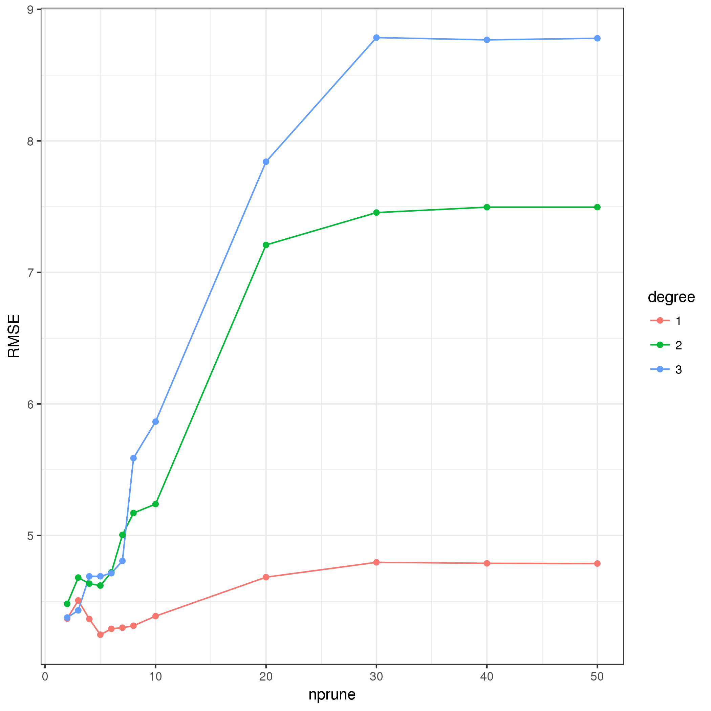

# Model 2

Prediction model for `Y2`.

Train model over the tuning parameters.

```{r Y2Training}
cl <- makeCluster(cores)
registerDoParallel(cl)
trainingModel <-
  dfTrainPreProc %>% 
  select(-c(id, Y1, Y3)) %>% 
  train(Y2 ~ ., data = ., method = method, trControl = ctrl, tuneGrid = grid)
stopCluster(cl)
trainingModel
trainingModel %>% 
  .$results %>% 
  mutate(degree = factor(degree)) %>% 
  ggplot() + 
  aes(x = nprune, y = RMSE, color = degree, group = degree) +
  geom_line() +
  geom_point() +
  theme_bw()
save(trainingModel, file = "output/Y2Training.RData")
```



```{r Y2Training-finalModel}
trainingModel$finalModel
summary(trainingModel$finalModel)
plot(trainingModel$finalModel)
varImp(trainingModel)
```

```{r Y2Training-predict}
dfTrainPred <- 
  dfTrainPreProc %>% 
  mutate(hat = predict(trainingModel, dfTrainPreProc) %>% as.numeric())
postResample(pred = dfTrainPred$hat, obs = dfTrainPred$Y2)
cor(dfTrainPred %>% select(Y2, hat))
dfTrainPred %>% 
  ggplot() +
  ggtitle(sprintf("Correlation = %.03f", cor(dfTrainPred %>% select(Y2, hat)) %>% .[1, 2])) +
  aes(x = hat, y = Y2) +
  geom_abline(slope = 1, intercept = 0) +
  geom_smooth(method = "lm", formula = y ~ x - 1, color = rgb(0, 0, 1, 0.5), se = FALSE) +
  geom_smooth(method = "lm", formula = y ~ x, color = rgb(1, 0, 0, 0.5), se = FALSE) +
  geom_point(alpha = 1/2)
```

Evaluate model on the validation sample.

```{r Y2Validation-predict}
dfValidPred <- 
  dfValid %>% 
  select(-c(id, Y1, Y3)) %>% 
  select(-one_of(nzv$varname)) %>%
  filter(complete.cases(.)) %>% 
  predict(preProc, .) %>% 
  mutate(hat = predict(trainingModel, .) %>% as.numeric())
postResample(pred = dfValidPred$hat, obs = dfValidPred$Y2)
cor(dfValidPred %>% select(Y2, hat))
dfValidPred %>% 
  ggplot() +
  ggtitle(sprintf("Correlation = %.03f", cor(dfValidPred %>% select(Y2, hat)) %>% .[1, 2])) +
  aes(x = hat, y = Y2) +
  geom_abline(slope = 1, intercept = 0) +
  geom_smooth(method = "lm", formula = y ~ x - 1, color = rgb(0, 0, 1, 0.5), se = FALSE) +
  geom_smooth(method = "lm", formula = y ~ x, color = rgb(1, 0, 0, 0.5), se = FALSE) +
  geom_point(alpha = 1/2)
```
